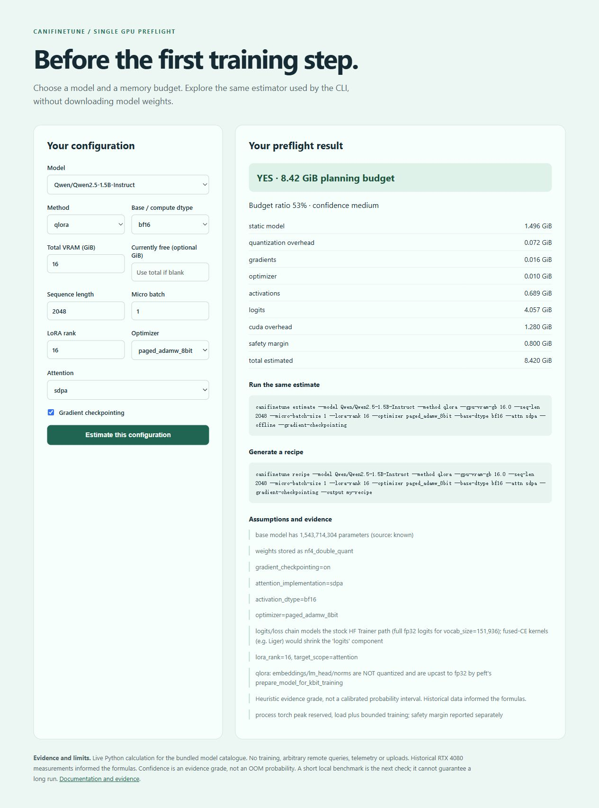
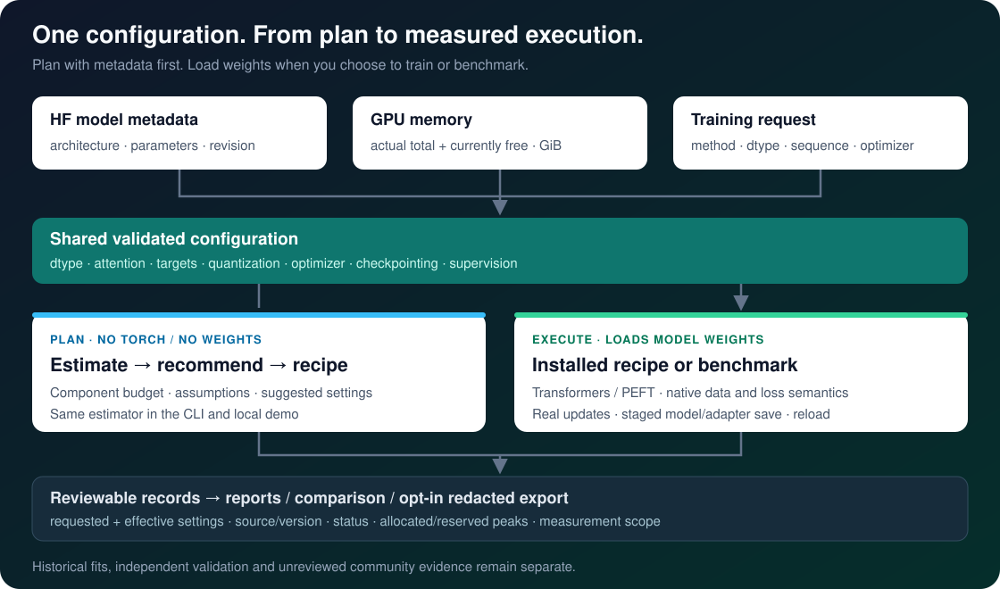

---
hide:
  - toc
---

<div class="cft-hero">
  
  <div>
    <p class="cft-eyebrow">CANIFINETUNE / 单卡微调前检查</p>
    <h1>这张显卡，能微调这个 LLM 吗？</h1>
    <p class="cft-lead">下载权重之前先估算显存；选好配置，生成配方，再用真实本地运行检验计划。</p>
    <div class="cft-actions"><a class="md-button md-button--primary" href="quickstart/">开始第一次运行</a><a class="md-button" href="../">English documentation</a></div>
  </div>
</div>

## 从你的问题开始

| 你的问题 | 工具提供什么 | 下一步 |
| --- | --- | --- |
| 训练显存够不够？ | 权重、梯度、优化器、activations、logits/loss 等分项 | [估算与推荐](../workflows.md) |
| 配置应该怎么选？ | 明确假设和候选配置，生成对应命令 | [第一次运行](quickstart.md) |
| 配方能不能跑？ | 真正更新、保存模型或 adapter、重载生成 | [训练约定](../training.md) |
| 估算与实际差多少？ | 有测量口径和来源的本地记录 | [证据指南](../evidence.md) |

## 无需下载权重，先获得一个结果

```console
python -m pip install canifinetune==0.4.1
canifinetune estimate --model Qwen/Qwen2.5-1.5B-Instruct --method qlora --gpu-vram-gb 16 --seq-len 2048 --offline
canifinetune demo
```

结果为 **8.420 GiB / YES / medium**，这是含安全余量的规划预算。
核心不依赖 torch，不加载模型权重。`medium` 是启发式证据等级，不是统计概率。



网页估算器由 `canifinetune demo` 在本机提供，地址为 `127.0.0.1:8765`。
这个公开文档站提供指南和记录，在线阅读不会自动在你的电脑上训练或启动估算服务。

## 理解系统和结果

<picture>
  <source media="(max-width: 760px)" srcset="../assets/architecture-mobile.svg">
  
</picture>

原生 Windows RTX 4080 上的四个前瞻 0.5B LoRA / QLoRA 配置全部完成三次更新，
进程 reserved 峰值为 1.666–2.398 GiB。新旧估算预测相同，MAPE 为 46.2%，全部偏高；
没有证明估算精度提升。单模型、单显卡的短运行也不能证明跨硬件精度或长训练稳定性。

[详细观测与原始记录](../validation-0.4.0.md) ·
[兼容性与迁移](../compatibility.md) · [排错指南](../troubleshooting.md)

中文页面覆盖项目入口和实际安装；训练语义、公式与证据规则沿用同一套英文技术手册。
欢迎通过[贡献指南](https://github.com/DaoyuanLi2816/can-i-finetune-this/blob/main/CONTRIBUTING.md)
提交可复现测量或改善首次使用体验。
